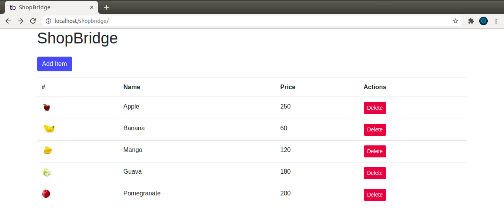
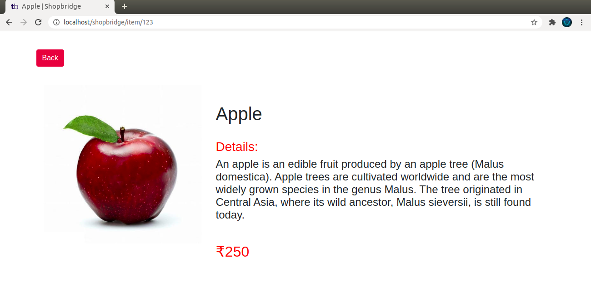
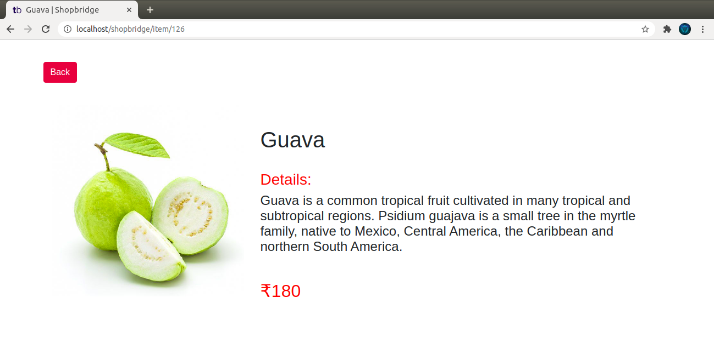
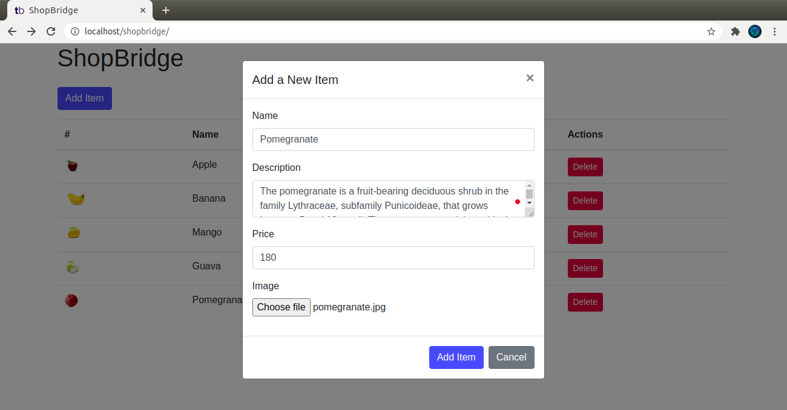
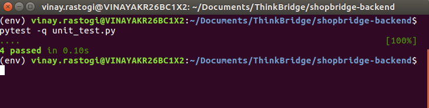

# ShopBridge

ShopBridge is the assessment containing 2 pages to add item to inventory, delete item from inventory and see detailed view of the item.
Project uses PostgresQL as database. Backend service is made using Python Flask and Frontend service is made using React.

# Screenshots

# Below are steps to Setup this Project

### Setup Database

Database used here is PostgresQL. Open Terminal at Project folder and follow below steps to configure database -

  1. Login to Postgres CLI : psql -U (username)
  2. create database by using : create database shopbridgedb;
  3. Exit postgres cli by ctrl+D or \q
  4. Restore dump by : psql -U (username) shopbridgedb < shopbridgedb
  5. Optionally, You can also follow sql commands listed in file "database_scripts.sql" to setup database.

### Setup Backend (Gunicorn)

We will use gunicorn to setup our backend as a service on port 8090. Then we will use apache2 proxyPass to create proxy. Open Terminal at Project folder and follow below steps -

  1. cd shopbridge-backend/
  2. Open properties.py file and change properties config according to your postgres database.
  3. Activate your virtualenv if using virtual environment
  4. Install requirements : pip install -r requirements.txt
  5. sudo nano /lib/systemd/system/shopbridge.service
  6. paste following - 
~~~
[Unit]
Description=BackendService
After=network.target

[Service]
User=vinay.rastogi
WorkingDirectory=/path/to/project/folder/shopbridge-backend
ExecStart=/path/to/virtual/env/bin/gunicorn -b 0.0.0.0:8090 -w 4 main:app
Restart=always

[Install]
WantedBy=multi-user.target
~~~

  7. sudo systemctl daemon-reload
  8. sudo service shopbridge start

By now your service is created and running at port 8090. Now we will use proxyPass to put our service behind port 80. Follow below steps -

  1. cd /etc/apache2/conf-available/
  2. sudo nano shopbridge-backend.conf
  3. paste following - 
~~~
ProxyPass "/shopbridge-backend" "http://127.0.0.1:8090"
ProxyPassReverse "/shopbridge-backend" "http://127.0.0.1:8090"
~~~

  4. sudo a2enconf shopbridge-backend
  5. sudo a2enmod proxy
  6. sudo a2enmod proxy_http
  7. sudo service apache2 restart
  8. Now backend service is hosted at - http://localhost/shopbridge-backend/

### Backend Unit Testing

4 test cases has been designed. pytest has been used to perform the testing. Open Terminal at Project folder and follow below steps -

  1. cd shopbridge-backend/
  2. pytest -q unit_test.py
  3. Verify if all 4 test have Passed.

### Setup Frontend

We will make a production build and deploy at basepath http://localhost/shopbridge/. If you want to change the basepath to something different then change "homepage" parameter in package.json and Router basename in App.js. Also, if you deployed your backend other than the endpoint stated above, please change file - ".env.production".

Open Terminal at Project folder and follow below steps -

  1. cd shopbridge-frontend/
  2. yarn install
  3. yarn build
  4. cp -r build/ /var/www/html/shopbridge/
  5. cp .htaccess /var/www/html/shopbridge/

Now service is hosted at - http://localhost/shopbridge/

